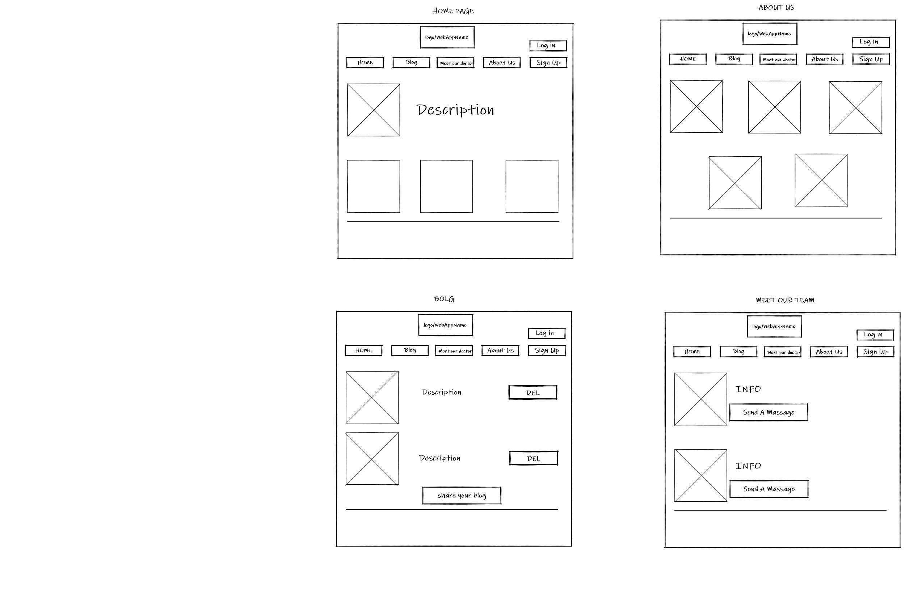
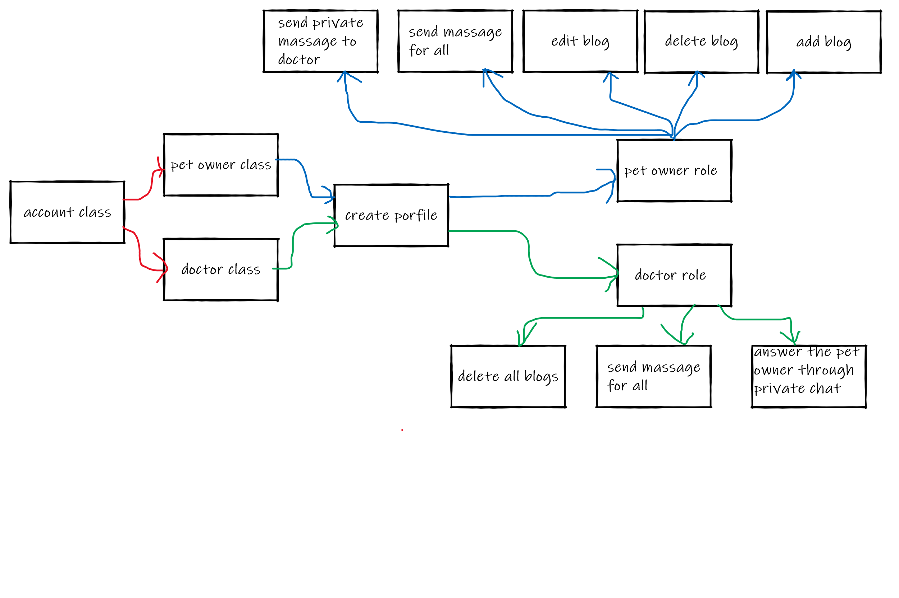
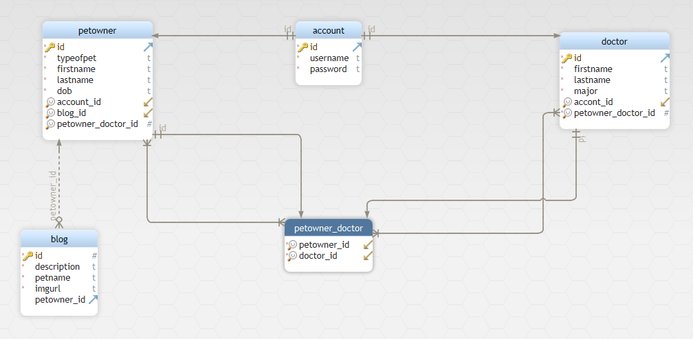

# PETSO-CLINIC
***This is an organization to take care of pets***

##  Our Team
- ***Alaa Al-abbas***
- ***Amara Al Balkhi***
- ***Fadi Nayef***
- ***Maryam Najjar***
- ***Motasim AL-Azzam***

## Cooperation Plan

***Each one of my team was very good in connection and they try to search about the problem that faced us through our working. I found all of them are motivated to complete the project to look like in the best picture. We would like to work more on spring security to protect our app and we get trust from people that use our app. Every one of us works on his/her parts then explain it to another.***
## Communication Plan     

- ***What hours will you be available to communicate***?**All the days we working together to know everyone what the team do.**
- ***What platforms will you use to communicate (ie. Slack, phone …)***?**Slack and Discord.**
- ***How often will you take breaks?*** **we didn't have many breaks because we have a lot of tasks but we are trying to have a small break between work.**
- ***What is your plan if you start to fall behind?***
**To work for more time and its ok, it's just a period of time and it will be finish**
- ***How will you communicate after hours and on the weekend?***
**We all have communication with each other we never mind if it's work hours or not.**
- ***What is your strategy for ensuring everyone’s voice is heard?***
**always we are in the meeting to ensuring hear everyone’s voice.**
- ***How will you ensure that you are creating a safe environment where everyone feels comfortable speaking up?***
**I tried to ask everyone about his opinion and everyone's working if they want and when they want.**
 
## Conflict Plan
- ***What will be your group’s process to resolve conflict, when it arises?***
**We work together to haven't any conflict**
- ***What will your team do if one person is taking over the project and not letting the other members contribute?***
**We connnect with our instructor to take with this member**
- ***How will you approach each other and the challenges of the project knowing that it is impossible for all members to be at the exact same place in understanding and skill level?***
**We tried to be friendly with each other and if we haven't understood something we try to search for it.**
- ***How will you raise concerns to members who are not adequately contributing?***
**I say we are resposible about this project and you are a part of this group so if you do not share your knowlege, Our project will look like so bad and I think you refuse that.** 
- ***How and when will you escalate the conflict if your resolution attempts are unsuccessful?***
**We have a meeting every days to push and marge our work**

## Work Plan
1. ***How you will identify tasks, assign tasks, know when they are complete, and manage work in general?***
**In the first meeting of the team, we determined the features that the site will include, and based on that, we set a time plan for implementing each feature on the sites. The group members were divided into pairs to work on each feature identified for them. Set an hour for the meeting to consider what has been accomplished.**
2. ***What project management tool will be used?***
**We put list for each day to do.**

## Git Process

- ***What components of your project will live on GitHub?***
**We had packadges for everything for the classes, infrastructure, controller, services, web security config and the webSocket**
- ***How will you share the repository with your teammates?***
**Everyone do git clone of our repository and create a branch. Finally push his/her work to github**
- ***What is your Git flow?***
**This workflow uses many branches to record the history of the project. The main branch stores the official release history, and the develop branch serves as an integration branch for features. It's also convenient to tag all commits in the main branch with a version number.**
- ***Will you be using a PR review workflow? If so, consider:***
      -  ***How many people must review a PR?***
        **We are five people, One of us can create PR and show us that to check**
      - ***Who merges PRs?***
      **We are five people, One of us can create PR and show us that to check**
      - ***How often will you merge?***
     **I think until now We have one or two times to merge**  
      -  ***How will you communicate that it’s time to merge?***
       **After everyone had finished his work. They told me to merge one by one at the same time we solve the conflict togther according to our works**

## Our wireFrame

## User Stories

***We created a web app for a pet clinic that has pet owners and doctors where the pet owner can share his blog and consult the doctor about his pet at the same time he can connect with other pet owners through general chat. In addition, he can delete or edit the blog***

 ### As a role `Pet Owner`, I want to ability to modify my blog  and consult the doctor
 ### As a role `Doctor`, I want to ability to accept the answer from the pet owner and answer him and delete the pet owner's blogs

- ***Feature tasks***
1. **create profile** 
2. **add blog**
3. **edit my blog**
4. **delete my blog**
5. **connect with other pet owners**
6. **consult the doctor**

- ***Acceptance Tests***
1. **create profile** 
2. **accept the massage from  all the pet owners in the general chat**
3. **doctor answer the pet owner**
4. **delete all blogs**
5. **Ensure that the blogs and all massages successfully save into database**

## Software Requirements
- ***What is the vision of this product?***
**TO take care our pet around the world**

- ***What pain point does this project solve?***
***This app permit to the pet owners around the world to connect with doctors and share the daily lif of their pets through this app***

- ***Why should we care about your product?***
**because most of people around the world have a got pet and try to connect with other pet owners and other doctors around the world** 

## Minimum Viable Product vs

- ***What will your MVP functionality be?***
1. **Pet owner profile**
2. **Doctor profile**
3. **How to sign up for both of them** 
4. **Create a blog page and make the pet owner share his blog with others, in addition, he can delete or edit the blog**
5. **Create profile page for the doctors**
6. **Create a general chat between pet owners**
7. **create a privte chat between doctor and pet owner** 

- ***What are your stretch goals?***
1. **vedio call between the doctor and the owner**
2. **pet owner can commet  and like on the others blog**
3. **pet owner and doctor can reply every massage in general chat**
4. **users can add and follow each other**

## Functional Requirements

1. **petowner and doctor can create profile** 
2. **petowner can add blog**
3. **petowner can edit my blog**
4. **petowner can delete my blog**
5. **petowner can connect with other pet owners**
6. **petowner can massage the doctor**
7. **doctor can answer the pet owner**
8. **doctor can delete all blogs**
9. **doctor can write in the general chat**

## Domain Modeling

## Database UML Diagram
